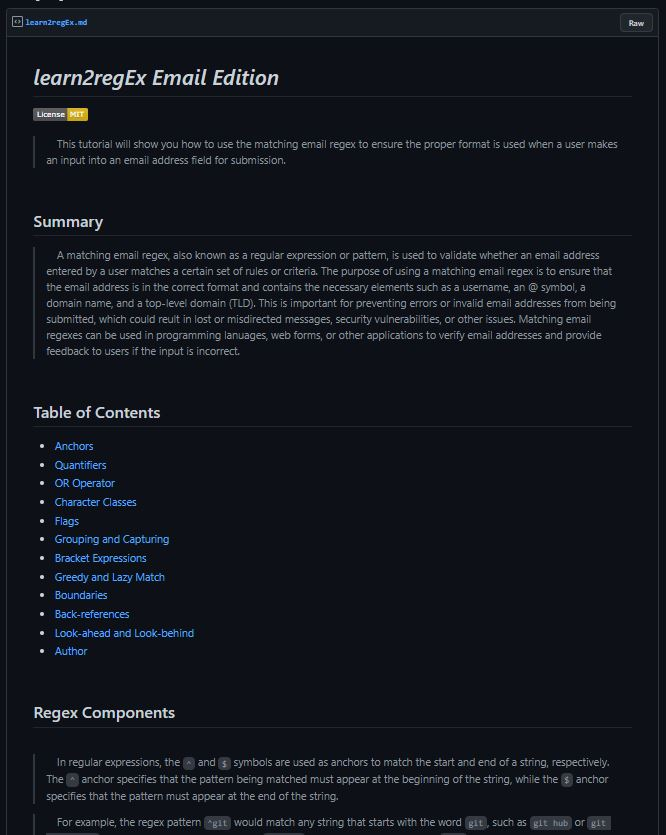

# Learn2regEx Email Edition

## Table of Contents 
- [Description](#description)
- [Usage](#usage)
- [Questions](#questions)

## Description
This is a tutorial project that teaches the basics of email validation with regular expressions.

## Usage
This GitGist can be viewed at:  https://gist.github.com/jk377y/01f8ff07e44633737bc15bdb4a45e6fc

## Questions

James Kelly 
Full Stack Web Developer / UTA BootCamp Student 
 